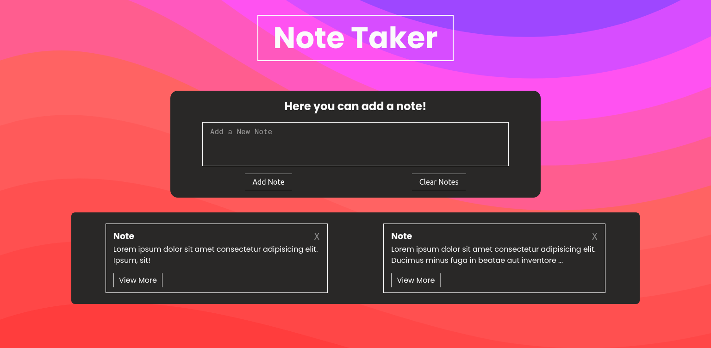
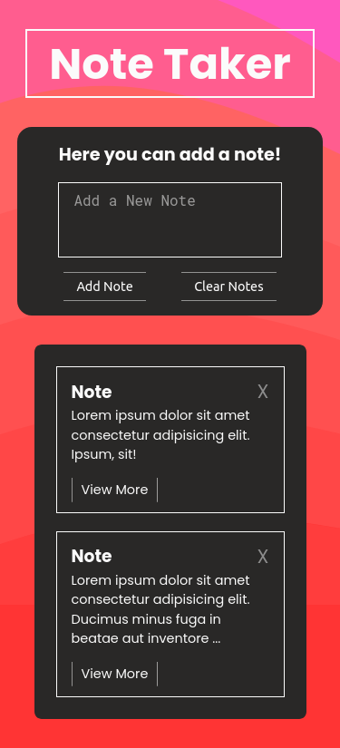

# Note Taker

This is a simple app to take notes.

## Table of contents

- [Overview](#overview)
  - [Screenshots](#screenshot)
  - [Live Site](#live-site)
- [My process](#my-process)
  - [Built with](#built-with)
  - [What I learned](#what-i-learned)

## Overview

### Screenshots

### Live Site

- [Live Site](https://airdgo-note-taker-app.netlify.app/)

## My process

### Built with

- Semantic HTML5 markup
- SASS
- Flexbox and Grid
- JavaScript

### What I learned

How to use local storage to save user input and then display it on the page.